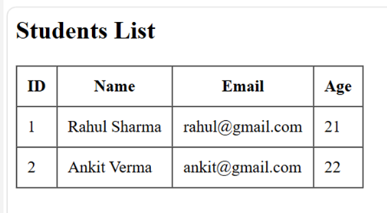
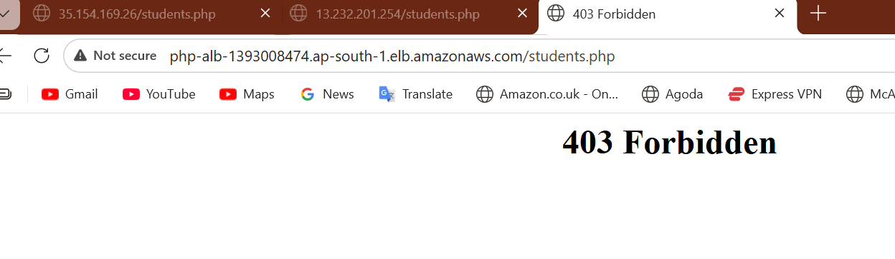
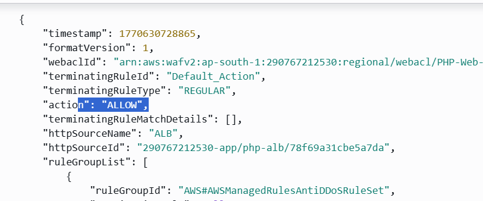
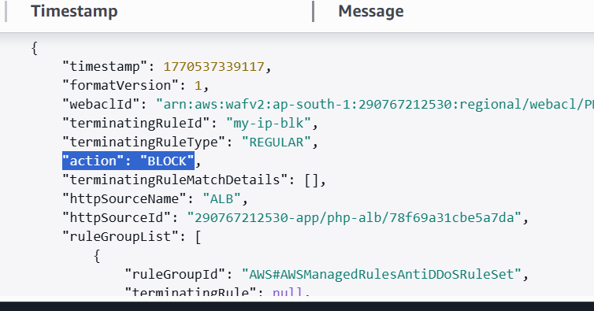

# Secure PHP Web Application using AWS WAF

## Overview
This project demonstrates how to deploy and secure a PHP web application on AWS
using AWS WAF with priority-based rules in front of an Application Load Balancer.
The application runs on EC2 instances and uses a MySQL database.

## Architecture Flow
User → AWS WAF → Application Load Balancer (ALB) → EC2 (PHP + Apache) → MySQL  
AWS WAF logs are sent to CloudWatch Logs for monitoring and analysis.

## AWS Services Used
- Amazon VPC
- EC2 (Apache + PHP)
- Application Load Balancer (ALB)
- AWS WAF (IP Block, SQL Injection, CAPTCHA, Rule Priority)
- Amazon RDS (MySQL)
- Amazon CloudWatch Logs

## Security Features
- AWS WAF attached to ALB
- IP blocking rules
- SQL Injection protection
- CAPTCHA for suspicious traffic
- Rule priority configuration
- Request logging using CloudWatch Logs

## Project Structure
secure-php-aws-waf-project/
├── src/
├── sql/
├── architecture/
├── screenshots/
└── README.md

## Screenshots

### Application Access via ALB

### Application Access via EC2

### AWS WAF Blocked Request (403)

### AWS WAF CAPTCHA Working

### AWS WAF SQL Injection Blocked

### CloudWatch Logs – Allowed Request

### CloudWatch Logs – Blocked Request

